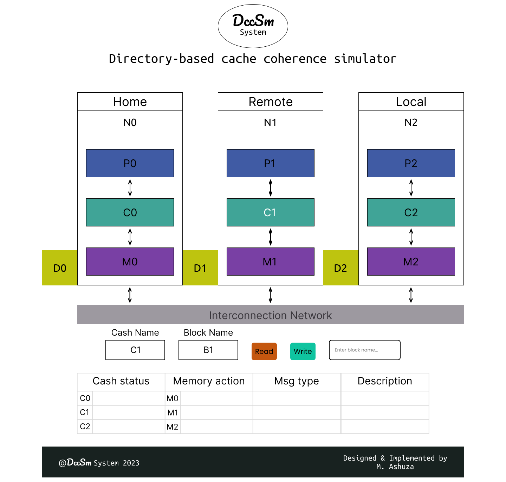

## Directory-based cache coherence simulator

# Vue d'ensemble
DccSm System est un simulateur de cohérence de cache basé sur les répertoires qui supporte le protocole MESI. Il prend des traces de référence en mémoire, simule le trafic du cache et des répertoires. 

# Contexte
Un protocole de cohérence de cache basé sur un répertoire résout le problème de cohérence de cache dans les systèmes à mémoire partagée distribuée ou NUMA. Chaque cœur est connecté à un répertoire qui garde trace de l'état des lignes de cache dans la mémoire locale du cœur au lieu d'utiliser un bus comme dans un protocole basé sur le snooping. Sa plus grande force est qu'il est très évolutif car les cœurs ne parlent qu'aux cœurs qui les intéressent au lieu de diffuser le message sur l'ensemble de l'interconnexion.

# Motivation
La cohérence du cache est l'un des sujets les plus importants dans la conception des caches multiprocesseurs. ce projet est le projet finale pour le cours de SYSTEMES A MULTIPROCESSEURS ET 
MACHINES PARALLELES en 1 année de licence, filier ingenierie logiciel a l'ULPGL Goma.

# Design 


## Setup & Installation

Assurez-vous d'avoir la dernière version de Python et de pip installée.

```bash
git clone <repo-url>
```

```bash
pip install -r requirements.txt
```

## Running The App

```bash
python main.py
```

## Viewing The App

Go to `http://127.0.0.1:5000`


